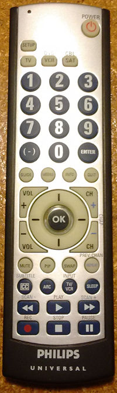

# LIRC configuration

## Philips universal remote (SRU3004MW/17)

A `.conf` file for [lirc](http://lirc.org) for an old universal remote:




### Requirements

You should have a working instance of LIRC, receiver. etc. Please refer to
one of the several guides elsewhere online.


### Usage

First, configure the remote to send MCE signal codes. You can use either
profile button: <kbd>VCR</kbd> or <kbd>SAT</kbd>.

1. Press and hold <kbd>SETUP</kbd> until the red light remains lit.
2. Press the desired profile button (<kbd>VCR</kbd> or <kbd>SAT</kbd>);
   the red light should blink once.
3. Type in the code for MCE: <kbd>1</kbd><kbd>6</kbd><kbd>1</kbd><kbd>1</kbd>;
   the red light should blink after each digit then turn off.

Next, install the provided configuration file and image into `/etc/lirc`:
```
# cp ph* /etc/lirc/
```

To actually enable the keymap, you should probably use your system's
graphical interface.

* For Kodi/OSMC, try navigating into `My OSMC > Remotes`
* To enable it manually, copy the conf file as `/etc/lirc/lircd.conf`

