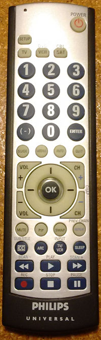

# LIRC configuration

## Philips universal remote (SRU3004MW/17)

An [LIRC](http://lirc.org) `.conf` file for my old universal remote,
optimized for use with [Kodi](https://kodi.tv).




### Setup

LIRC is included with Kodi by default. 


#### Prepare Raspberry Pi

* Add an [IR receiver](http://kodi.wiki/view/Raspberry_Pi#Remote_controls)
* Navigate to `My OSMC > Pi Config > Hardware Support` and verify
    * 'Enable LIRC GPIO support': enabled
    * 'gpio_in_pin': 18

#### Configure the remote

First, configure the remote to send MCE signal codes.

1. Press and hold <kbd>SETUP</kbd> until the red light remains lit.
2. Press the desired profile button (<kbd>VCR</kbd> or <kbd>SAT</kbd>);
   the red light should blink once.
3. Type in the code for MCE: <kbd>1</kbd><kbd>6</kbd><kbd>1</kbd><kbd>1</kbd>;
   the red light should blink after each digit, then turn off.

#### Add to LIRC

Clone this repository to the local file system, then copy relevant files
into `/etc/lirc`:
```
# git clone https://github.com/patricktokeeffe/lirc-philips-sru3004wm17.git
# cd lirc-philips-sru3004wm17
# sudo cp ph* /etc/lirc/
```

#### Enable keymap

* For Kodi/OSMC, choose `My OSMC > Remotes > philips-sru3004wm17`
* To enable it manually, copy the conf file as `/etc/lirc/lircd.conf`

